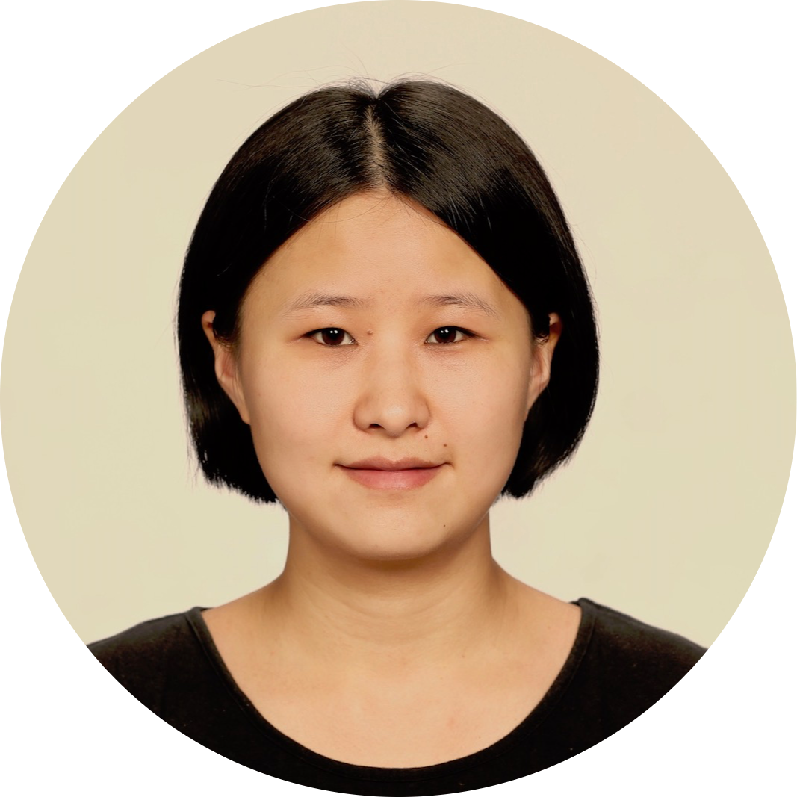

<h1 id="jie-zhou-leblond">Jie Zhou-Leblond </h1>

----

>   
  GitHub: [touilleWoman][5]

----

Experience
----------------
2020 (6 mois)
:   **Développement Backend Python/Django chez Numizon** - Paris
    
    [**Vidéo de stage sur YouTube**][7]

        Environnement technique: Django, PostgreSQL, Git, VueJs

        Services:  Heroku, Amazon S3, Tineye(Matching image), Google OCR

        Lib: Celery, Beautiful Soup, Selenium, PyTest

2017 - 2019
:   Traductrice freelance français-chinois - Paris

2017 (6 mois)
:   Traductrice stagiaire chez Hachette-Phoenix Cultural Development - Pékin (Chine)

2012 (5 mois)
:   Semestre d'échange à Université de Konkuk - Seoul (Corée du Sud)

Projets
----------------------

2018.11 - Aujourd'hui
:  

    * [**N-puzzle**][4] : résoudre le jeu "taquin" avec algo A* (en RUST)

    * [**Corewar**][1] : implémentation d'une machine virtuelle et d'un assembleur dédié (en C)
        * test en Python avec Pytest et Hypothesis 
        * debugger de VM en Python via ctypes 

    * [**Lem-in**][2] : trouver les chemins optimaux pour traverser une fourmilière (en C)
        * implémentation de l'algorithme d'Edmonds-Karp avec adapdation

    * [**wolf3D**][3] : moteur graphique de type ray-casting codé avec la lib-SDL (en C)

    * [**push_swap**][6] : algotithme de tri (en C)

Formation
---------

2018.11 - Aujourd'hui
:   **École 42**  – Paris

        Développement informatique — C, Rust, Python

2013 - 2017
:   **Université Sorbonne Nouvelle - Paris 3** –  Paris

        Master Traduction et terminologie juridiques et financières

        Master Etudes Européennes

        Diplôme Universitaire de Langue Française

2009 - 2013
:   **Université du Hunan - 湖南大学** –  Changsha (Chine)

        Licence en économie et commerce internationaux

Langue
----------------
Chinois          
:   Langue maternelle

Français 
:   Capacité professionnelle complète

Anglais
:   Capacité professionnelle complète

Allemand
:   Notions

----

> <jie.zhou.ac@gmail.com>  Tél: +33(0)652002116\

[1]: https://github.com/touilleWoman/corewar/tree/master
[2]: https://github.com/touilleWoman/Lem_in
[3]: https://github.com/touilleWoman/wolf3d
[4]: https://github.com/touilleWoman/N-Puzzle_with_Rust
[5]: https://github.com/touilleWoman
[6]: https://github.com/touilleWoman/Push_swap
[7]: https://www.youtube.com/watch?v=jLiXZENA0no
